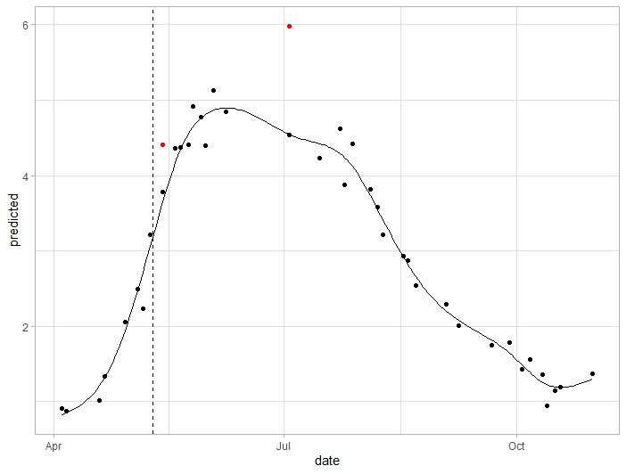

**Script to model LSP and detect SOS metrics from Sentinel-2 derived indices**
author: **Ewa Grabska-Szwagrzyk**

This script is used to calculate LSP (Land Surface Phenology) and detect SOS (start of season) in the paper *Sentinel-2 time series: a promising tool in monitoring individual species phenology and its variability* by Grabska-Szwagrzyk and Tymińska-Czabańska. 

The script uses raw indices values derived from Sentinel-2 time series, calculated and downloaded from GEE using script: ... 
It includes pre-processing, cleaning and outlier removing, modelling LSP using GAM and detecting SOS using derivatives. 

It works like in the example below for single sample and one year:

* black dots represent original indices values
* red dots represent outliers
* black line is fitted GAM function
* dashed vertical line is the detected SOS date 

