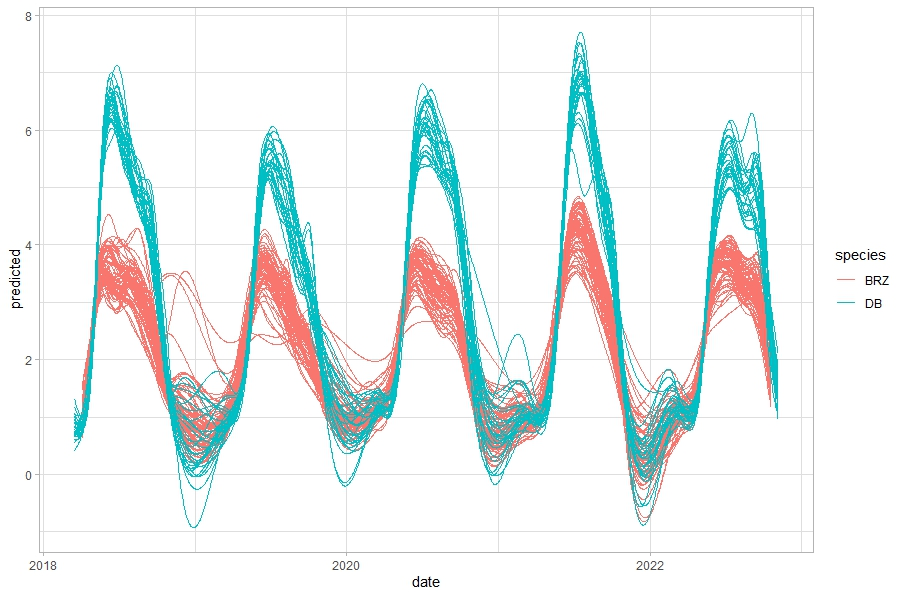

**Script to model LSP and detect SOS metrics from Sentinel-2 derived indices**  
author: **Ewa Grabska-Szwagrzyk**

The script **modelling_and_sos_detection.R** is used to calculate LSP (Land Surface Phenology) and detect SOS (start of season) in the paper *Sentinel-2 time series: a promising tool in monitoring individual species spring phenology* by Grabska-Szwagrzyk and Tymińska-Czabańska. It includes pre-processing, cleaning and outlier removing, modelling LSP using GAM and detecting SOS using derivatives. 

The script uses raw indices values derived from Sentinel-2 time series, calculated and downloaded from GEE using [this script](https://code.earthengine.google.com/6f6a5fae3a4c016b9d41c96ba24017a7)  

It works like in the example below for single sample and one year:

* black dots represent original indices values
* red dots represent outliers
* black line is fitted GAM function
* dashed vertical line is the detected SOS date 

The second script, **GAM_modelling.R** allows to only calculate LSP based on GAM modelling (without SOS detection) for the whole analyzed period. 
The example results for two species (BRZ is silver birch and DB is oak):

